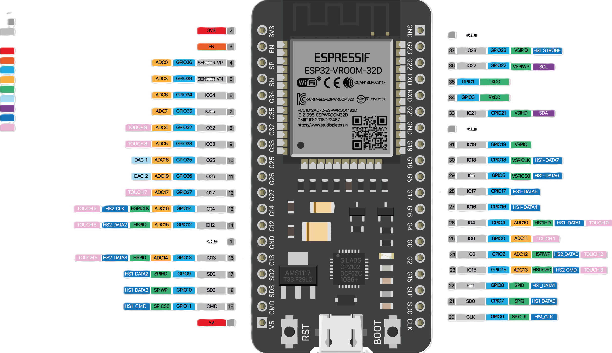
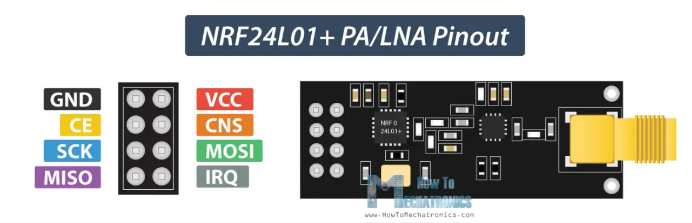

# esp32-jammer

## DISCLAIMER: Jamming is an illegal practice. This software and hardware is a PoC only for educational purpose!

## What does this project do?
This application creates a **noise signal** to interfere Wifi and Bluetooth signals. (Effects can may vary depending on the bluetooth versions of target devices)

## PlatformIO
This project use PlatformIO, to build follow steps on official [documentation](https://platformio.org/install/ide?install=vscode).

## Required Components
* **1x** [Prototype PCB](https://s.click.aliexpress.com/e/_DCH2WLJ) (at least 7x9 cm)
* **1x** [ESP32 Dev Module](https://s.click.aliexpress.com/e/_DdFXWrr) (such as ESP32-WROOM-32U, any ESP32 should work as long as it has the needed pins)
* **2x** [NRF24L01 + PA + LNA](https://s.click.aliexpress.com/e/_DFGzAFP)
* **2x** [10uF](https://s.click.aliexpress.com/e/_DCsQ9St) (any voltage above 5V)

### ESP32 Dev Module (1x)

### NRF24L01 + PA + LNA (2x)

#### HSPI
| NRF24L01      | HSPI Pin (ESP32) | 10uf capacitor |
|---------------|------------------|----------------|
| VCC           | 3.3V             | (+) capacitor  |
| GND           | GND              | (-) capacitor  |
| CE            | GPIO 16          |
| CSN           | GPIO 15          |
| SCK           | GPIO 14          |
| MOSI          | GPIO 13          |
| MISO          | GPIO 12          |
| IRQ           |                  |

#### VSPI 
| NRF24L01      | VSPI Pin (ESP32) | 10uf capacitor |
|---------------|------------------|----------------|
| VCC           | 3.3V             | (+) capacitor  |
| GND           | GND              | (-) capacitor  |
| CE            | GPIO 22          |
| CSN           | GPIO 21          |
| SCK           | GPIO 18          |
| MOSI          | GPIO 23          |
| MISO          | GPIO 19          |
| IRQ           |                  |

## Special Thanks
- This project is based on:
    - https://github.com/smoochiee/Bluetooth-jammer-esp32
    - https://github.com/EmenstaNougat/ESP32-BlueJammer